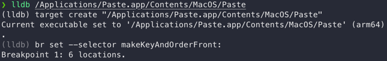
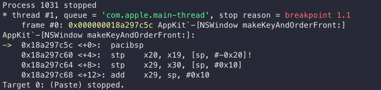
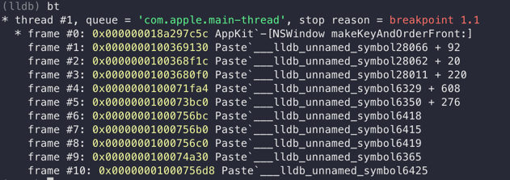
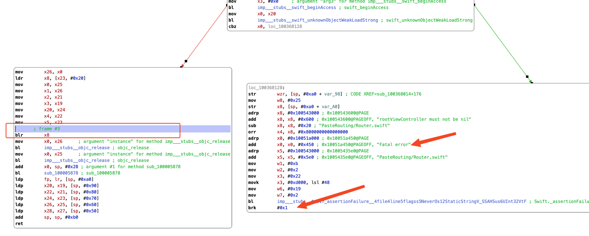
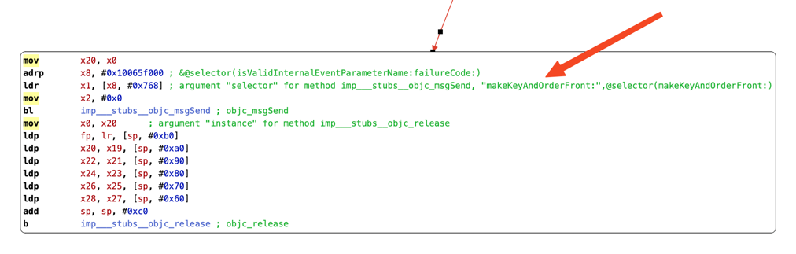
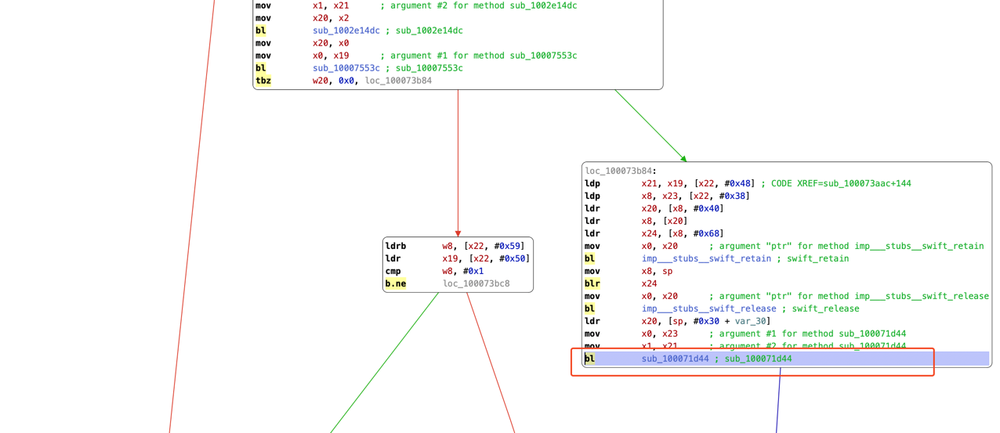
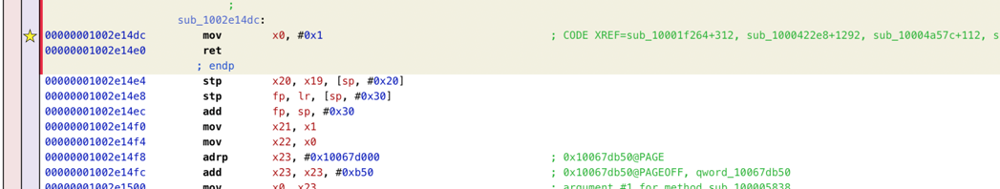
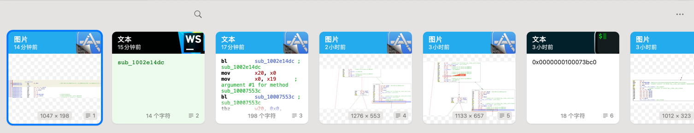

|         工具          |  应用   |  版本   |
|:-------------------:|:-----:|:-----:|
| Hopper Disassembler | Paste | 4.1.3 |

### 0x0. 分析
先运行程序，分析一下大概逻辑。

打开后有个弹窗提示订阅，粘贴记录上面有个🔒的图标，后面粘贴操作也会出现这个弹窗。
<hr>
大概逻辑如下

```javascript
    if (订阅) {
        粘贴
    } else {
        弹窗
    } 
```
对应到汇编里面就是一系列`条件跳转指令`。

我们要做的就是改变他的跳转结果。先找到弹窗的地址然后往上找一直找到他出现条件跳转的地方，最后改变这个跳转


### 0x1. 下断点

> br set --selector makeKeyAndOrderFront:


### 0x2. 运行程序

下断点后运行程序，暂停在了断点1.1上。输入`bt`查看调用栈


### 0x3. 分析关键跳转
打开Hopper导入Paste

> 注意：调用栈显示的地址上一行才是实际调用地址

**frame #1**是弹窗点，往下看**frame #3**出现第一个跳转指令


很显然这跳转不是我们想要的。

继续往下看**frame #4**出现第二个跳转指令

这里也不是，说明这个调用栈还在弹窗的这条分支上面

**frame #5**出现第三个跳转指令


这个跳转是否是弹窗这条分支的源头呢？

```javascript
    bl         sub_1002e14dc
    mov        x20, x0
    mov        x0, x19
    bl         sub_10007553c
    tbz        w20, 0x0, loc_100073b84    
    // w20 = 0，跳转到loc_100073b84
    // w20 != 0，跳转到到另一个分支
```
w20是`sub_1002e14dc`的返回值，我们直接改成1


生成新的可执行文件

### 0x4. 最终结果


正常使用，无弹窗🍻

